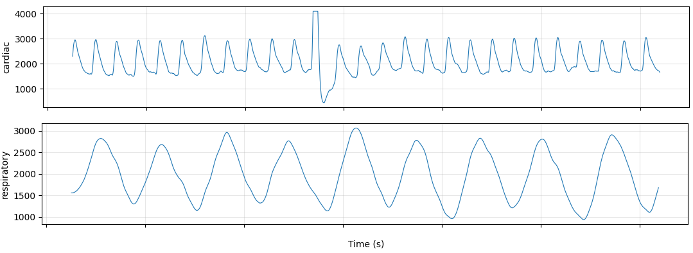
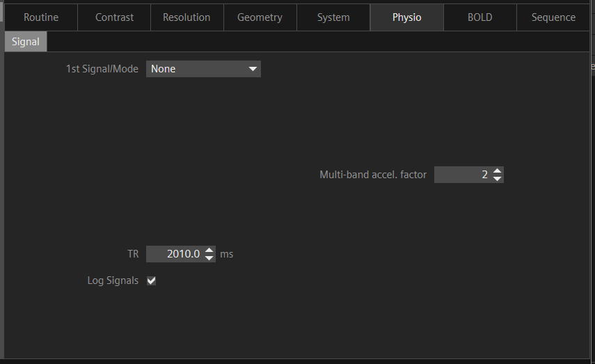
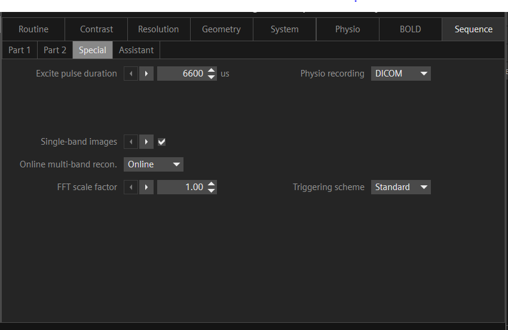

## About

Modern Siemens MRI scanners can embed physiological recordings into DICOM files. Recent versions of dcm2niix (since v1.0.20260603) attempt to convert these to [BIDS TSV format](https://bids-specification.readthedocs.io/en/stable/modality-specific-files/physiological-recordings.html). This validation repository includes sample images from a Siemens 3T Vida running XA60.

## Running

Run `batch.sh`. It converts `In/` → `Out/` and diffs against `Ref/`. Requires dcm2niix v1.0.20260603 or later.

## Notes

This repository includes a Python script (`viewtsv`) to visualize TSV data (requires `numpy` and `matplotlib`):

```bash
python viewtsv ./Ref/func-bold_task-rest_acq-dualecho_run-1_dicom_7_recording-respiratory_physio.tsv.gz
python viewtsv ./Ref/func-bold_task-rest_acq-dualecho_run-1_dicom_7_recording-cardiac_physio.tsv.gz
```



When you set up sequences, make sure you have selected to log physiological signals and are saving these logs as DICOM files.




## Trigger-sentinel handling (PULS_TRIGGER / RESP_TRIGGER, VALUE=2048)

Siemens CMRR-format PhysioLog DICOMs (`LogDataType = PULS` / `RESP`, raw payload at private tag `(7FE1,1010)`) encode physiological-event triggers as *sentinel rows* inserted between real ADC samples:

```text
ACQ_TIME_TICS  CHANNEL  VALUE  SIGNAL
     15639646     PULS   2843                ← real sample (even tick)
     15639647     PULS   2048  PULS_TRIGGER  ← sentinel (odd tick, VALUE=2048)
     15639648     PULS   2823                ← real sample
```

Real samples land on even ticks (200 Hz = every 2 MDH ticks of 2.5 ms). Trigger rows use the **off-grid odd tick**, the reserved sentinel value **`VALUE = 2048`**, and an explicit fourth `SIGNAL` token (`PULS_TRIGGER`, `RESP_TRIGGER`, `EXT_TRIGGER`, or `ECG_TRIGGER`). `2048` never appears as a real PULS/RESP reading.

A naive parser that drops the fourth column will push `2048` straight into the waveform — visible as sharp spikes that distort HR estimation and spectral analysis. The two-line comment at [bidsphysio/dcm2bids/dcm2bidsphysio.py:213](https://github.com/cbinyu/bidsphysio/blob/96433fec332f0e3146d2878c18676c0293ce4536/bidsphysio.dcm2bids/bidsphysio/dcm2bids/dcm2bidsphysio.py#L213) is exactly that bug ("*Data lines with trigger have a forth column with 'PULS_TRIGGER', which we can ignore*"). The Siemens reference [physiodcm2tsv.py](https://www.magnetomworld.siemens-healthineers.com/clinical-corner/application-tips/physiologging) handles it correctly by separating sentinel rows on row-width:

```python
if len(parts) > 3:
    trigger_events.append((sample_time, raw_signal_value(parts[3])))  # PULS_TRIGGER → "4", RESP_TRIGGER → "8"
else:
    values[sample_time] = sample_value
```

`dcm2niix` (since the fix referenced by this validation set) follows the Siemens-reference policy: rows with a `*_TRIGGER` SIGNAL token are dropped from the sample stream rather than pushed in as `VALUE=2048`. The result is a clean cardiac/respiratory waveform with no 2048 spikes. This repository's `Ref/*_recording-cardiac_physio.tsv.gz` and `*_recording-respiratory_physio.tsv.gz` are the validated targets — `batch.sh` will diff freshly-converted output against them.

The captured `PULS_TRIGGER` / `RESP_TRIGGER` tics are also surfaced in the trigger column (column 2) at the nearest BIDS sample. Both cardiac peaks (in `cardiac_physio.tsv.gz`) and respiratory peaks (in `respiratory_physio.tsv.gz`) are merged with the scanner volume triggers from `ACQUISITION_INFO` and emitted as `1`. Since cardiac and respiratory live in separate TSVs, the disambiguating codes used by the Siemens reference (`4` for PULS, `8` for RESP, `1` for scanner) collapse to a single `1` here without information loss. The test bundle's `Ref/_7_recording-cardiac_physio.tsv.gz` has 31 non-zero trigger rows (27 cardiac peaks + 4 scanner volumes); `Ref/_7_recording-respiratory_physio.tsv.gz` has 13 (9 respiratory peaks + 4 scanner volumes).

## Links

 - [Siemens Physiologging code samples](https://www.magnetomworld.siemens-healthineers.com/clinical-corner/application-tips/physiologging) — this work is inspired by their reference `physiodcm2tsv.py`.
 - [bidsphysio](https://github.com/cbinyu/bidsphysio) — companion Python tool; see `dcm2bids/dcm2bidsphysio.py:213` for the upstream `PULS_TRIGGER` comment that motivated the dcm2niix fix.
